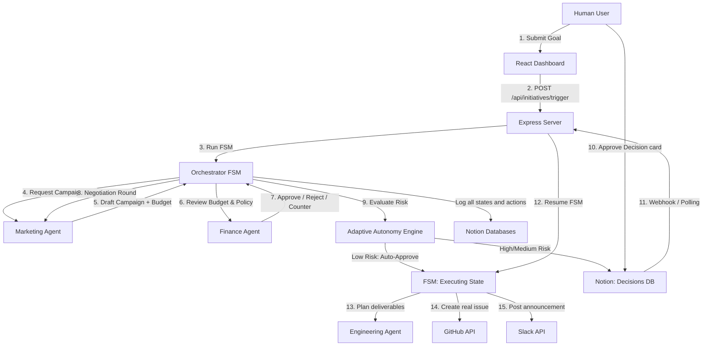

# AI-Native Enterprise Operating System

This project implements a multi-agent system where three departments (Marketing, Finance, Engineering) coordinate under a central state-machine Orchestrator. 

## System Architecture



---

## Created Notion Database & Workspace Summary

The automated setup script created the following structures under your parent page:

1. **Initiatives Database**: The ledger of company goals, owner, status (`Planning`, `Awaiting Approval`, `Executing`, `Done`), and rolled-up summaries.
2. **Agent Log Database**: The audit trail of agent requests, reasoning, counters, and errors.
3. **Decisions Database**: The human gate for approvals. Updates here resume the state machine.
4. **Actions Database**: Real links to created GitHub issues and Slack announcements.
5. **Company Budget Policy**: Standalone guidelines doc that the Finance agent reads to evaluate threshold limits.

---

## Running the Application

### 1. Start the Orchestrator Backend
From the `orchestrator` folder:
```bash
npm run dev
```
This runs the sanity checks and starts the Express server on `http://localhost:3000`. It also fires the background Notion database polling loop (runs every 15s) as a fallback mechanism for approval checks.

### 2. Start the Frontend Dashboard
From the `frontend` folder:
```bash
npm run dev
```
This launches the React development server. Open the displayed URL (usually `http://localhost:5173`) in your browser.

---

## Remaining Manual Actions

1. **Verify your Slack & GitHub values** in `orchestrator/.env`:
   - Set `GITHUB_TOKEN` to a valid Personal Access Token (PAT).
   - Set `GITHUB_REPO` to your active repository (e.g. `Madihawahab/AI_Enterprise_OS`).
   - Set `SLACK_BOT_TOKEN` and `SLACK_CHANNEL_ID` to post real Slack messages.
   *(Dummy stubs will automatically trigger if these remain placeholders).*
2. **Webhook Tunneling (Optional)**:
   - Run `ngrok http 3000` to get a public HTTPS URL.
   - Set `PUBLIC_BASE_URL` in `.env` to your ngrok URL.
   - Configure a webhook subscription in Notion to target `/webhooks/notion` (otherwise, the system will use the default automated polling fallback every 15s, which works immediately out of the box).
3. **Known Limitation**: The FSM lock map `processingInitiatives` is **in-memory only**. Do not restart the backend server while an initiative is mid-negotiation or awaiting human approval.

---

## Live Demo Verification Flow (Checklist)

Use this numbered checklist to verify the system or perform a live demo to show how the system resolves disagreements, gates decisions, executes actions, and learns:

### Part 1: Negotiation & Human-in-the-Loop Approval (Novel Goal)

- [ ] **1. Open Dashboard**: Access the React dashboard (`http://localhost:5173`) and click **"Open Notion Workspace"** to load the parent page.
- [ ] **2. Submit a Novel Goal**: In the dashboard form, enter the goal:
  *`"Launch a marketing campaign for our new feature, budget capped by company policy."`*
  Set owner to your name and click **"Kick Off Goal"**.
- [ ] **3. Watch Agent Log Negotiation**: Refresh your Notion **Agent Log** page or watch the terminal:
  - **Marketing** drafts a campaign and asks for a budget (typically $7,500).
  - **Finance** reviews the Company Budget Policy page, detects it exceeds $5,000, and counters with $5,000.
  - **Marketing** evaluates the pushback and submits a revised request of $6,250.
  - **Finance** runs a final check and auto-escalates to human approval since they remained in disagreement after the 1-round negotiation limit.
- [ ] **4. Verify Paused State**: Confirm the **Initiatives** status flips to `Awaiting Approval` and the state machine pauses.
- [ ] **5. Approve in Notion**: Go to your Notion **Decisions** database, find the pending decision card, and change its `Status` select field to `Approved`.
- [ ] **6. Confirm Automated Actions**: Within 15 seconds (via polling) or instantly (via webhook):
  - **Engineering** plans deliverables.
  - A real **GitHub Issue** is created with the technical spec.
  - A real **Slack message** is posted announcing the campaign.
  - Both URLs are written into the Notion **Actions** database.
  - The Initiative status on the ledger changes to `Done`.

### Part 2: Adaptive Autonomy (Low-Risk Recognition)

- [ ] **7. Re-run a Similar Goal**: In the React dashboard, submit a similar goal (e.g. *"Launch a marketing campaign for feature Y"*).
- [ ] **8. Verify Autonomy Auto-Approval**: Watch the Agent Log:
  - The Agents negotiate and land on a budget.
  - The **Adaptive Autonomy Engine** evaluates the request, recognizes it matches the previously approved campaign budget within 15%, and categorizes the risk as **Low**.
  - The Orchestrator writes a log entry: `[Adaptive Autonomy: AUTO-APPROVED $X. Matches approved decision...]`.
  - The state machine **skips the human approval gate** entirely, transitions straight to `Executing`, and fires the GitHub/Slack actions immediately.
- [ ] **9. Check the Autonomy Rate**: Go to the frontend dashboard and verify the "Autonomous" percentage gauge has increased.
