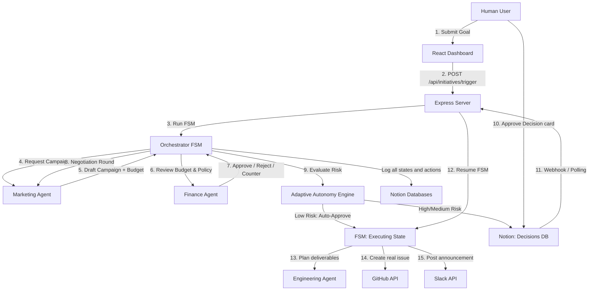

# CorpusAI

**Frontend -** https://corpus-ai-beryl.vercel.app/
<br>
**Backend -** https://corpusai-2ftb.onrender.com

CorpusAI is a multi-agent autonomous enterprise operating system that enables departments (Marketing, Finance, Engineering) to coordinate, negotiate, and execute complex corporate workflows under a centralized, FSM-guarded state machine. Powered by AI reasoning and backed by a Notion ledger control plane, it turns static documentation databases into active execution engines.

---


## 🏗️ System Architecture



---

## ⚡ Unique Selling Propositions (USPs)

*   **Notion as the Enterprise Control Plane:** No new software training needed. Managers trigger objectives, inspect progress, and authorize budgets directly inside their existing Notion databases.
*   **FSM-Guarded Workflows:** Multi-agent collaboration is boxed inside a strict Finite State Machine. This prevents infinite hallucination loops, runaway spending, and rogue agent behavior.
*   **Adaptive Autonomy & Risk-Engine:** Automatically computes decision risk. Low-risk actions (e.g. within budget and matching historical approvals) are auto-approved, while high-risk actions trigger human authorization gates.
*   **Audit-Log Ledger Persistence:** Every LLM prompt, thought process, disagreement, and tool activation is permanently recorded in a structured database ledger.

---

## ✨ Key Visual Features

*   **D3.js Lineage Graph with Animated Flow Particles:** A dynamic, force-directed node diagram tracking active agent pathways. Features glowing neon particles running along links to show real-time data transfer.
*   **Live Agent Negotiation Chat:** A high-fidelity message console displaying the actual dialogue between Marketing and Finance agents as they negotiate budget proposals. Includes an "Agent Thoughts" drop-down to expose agent reasoning logs.
*   **WebSocket Activity Terminal:** A low-latency scrolling developer terminal printing state-machine ticks, environment events, and middleware resolutions as they occur.
*   **Autonomy Rate Gauge:** A custom visual metric card showing the percentage of total decisions approved automatically by the Adaptive Autonomy Engine without human intervention.

---

## 🛠️ Technology Stack

| Layer | Technologies |
|---|---|
| **Frontend** | React 19, Vite, TypeScript, D3.js (Visual Lineage), Recharts (Agent Analytics), Lucide Icons |
| **Backend** | Node.js, Express, WebSockets (`ws`), TypeScript |
| **State Machine** | Custom state machine class with Notion interceptor middleware |
| **Integrations** | Notion API, GitHub API (Octokit), Slack Web API |
| **AI Layer** | NVIDIA NIM API (OpenAI-compatible), GPT-4o / LLama3 |

---

## 📓 Created Notion Database & Workspace Summary

The automated setup script initializes the following structures under your parent page:

1.  **Initiatives Database**: The main company goals registry containing names, owner, status (`Planning`, `Awaiting Approval`, `Executing`, `Done`), and rolled-up summaries.
2.  **Agent Log Database**: The audit ledger of agent proposals, reasoning, counters, and errors.
3.  **Decisions Database**: The human approval gateway. Status transitions here trigger/resume the orchestrator state machine.
4.  **Actions Database**: Log of external outcomes (URLs of created GitHub issues and Slack announcements).
5.  **Company Budget Policy**: Standalone text page outlining corporate guidelines, read by the Finance agent to judge proposals.

---

## 🏃 Running the Application

### 1. Start the Orchestrator Backend
From the `orchestrator` folder:
```bash
npm run dev
```
This runs env sanity checks and starts the Express + WebSocket server on `http://localhost:3000`. It also launches the background Notion database polling loop (polls every 15s) as a fallback mechanism.

### 2. Start the Frontend Dashboard
From the `frontend` folder:
```bash
npm run dev
```
This launches the Vite development server. Open the displayed URL (`http://localhost:5173`) in your browser to view the dashboard.

---

## 🔧 Production Deployment Config

*   **Backend (Render):** Deploy as a Web Service. Set root directory to `orchestrator`, build command to `npm install && npm run build`, and start command to `node dist/server.js`.
*   **Frontend (Vercel):** Deploy as a Vite site. Set root directory to `frontend`. Bind environment variables `VITE_API_URL` (HTTPS Render address) and `VITE_WS_URL` (WSS Render address) for secure WebSocket connections.

---

## 📋 Live Demo Verification Flow (Checklist)

Use this checklist to run a live demonstration showing negotiation, human gates, execution, and adaptive learning:

### Part 1: Negotiation & Human-in-the-Loop Approval

- [ ] **1. Open Dashboard:** Access the React dashboard (`http://localhost:5173`) and click **"Open Notion Workspace"** to load the Notion parent page side-by-side.
- [ ] **2. Submit a Goal:** In the dashboard form, enter the goal:
  *`"Launch a marketing campaign for our new feature, budget capped by company policy."`*
  Set owner to your name and click **"Kick Off Goal"**.
- [ ] **3. Watch Agent Log Negotiation:** Watch the **Agent Negotiation Chat** and **Live Activity Terminal** on the dashboard:
  - **Marketing** drafts a campaign and requests a budget (e.g. $7,500).
  - **Finance** reviews the budget policy, finds it exceeds the $5,000 limit, and counters with $5,000.
  - **Marketing** evaluates the counter, adjusts its plan, and requests a revised $6,250.
  - **Finance** runs a final check and auto-escalates to human approval since they remained in conflict after the 1-round negotiation limit.
- [ ] **4. Verify Paused State:** Confirm the **Initiatives** status flips to `Awaiting Approval` and the state machine pauses.
- [ ] **5. Approve in Notion:** Go to your Notion **Decisions** database, find the pending decision card, and change its `Status` select field to `Approved`.
- [ ] **6. Confirm Automated Actions:** Within 15 seconds (via polling fallback) or instantly (via webhook):
  - **Engineering** plans deliverables.
  - A real **GitHub Issue** is created with the technical specifications.
  - A real **Slack message** is posted announcing the campaign.
  - Both URLs are written into the Notion **Actions** database.
  - The Initiative status on the ledger changes to `Done`.

### Part 2: Adaptive Autonomy (Low-Risk Recognition)

- [ ] **7. Re-run a Similar Goal:** In the React dashboard, submit a similar goal (e.g. *"Launch a marketing campaign for feature Y"*).
- [ ] **8. Verify Autonomy Auto-Approval:** Watch the Live Chat:
  - The Agents negotiate and land on a budget.
  - The **Adaptive Autonomy Engine** evaluates the request, recognizes it matches the previously approved campaign budget within 15%, and categorizes the risk as **Low**.
  - The Orchestrator writes a log entry: `[Adaptive Autonomy: AUTO-APPROVED $X. Matches approved decision...]`.
  - The state machine **skips the human approval gate** entirely, transitions straight to `Executing`, and fires the GitHub/Slack actions immediately.
- [ ] **9. Check the Autonomy Rate:** Verify the "Autonomous" percentage gauge on the dashboard has increased.
